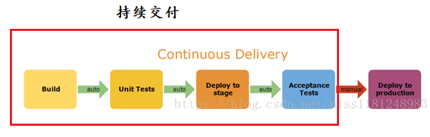
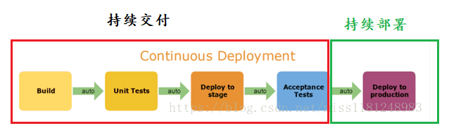
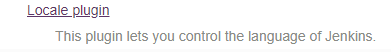
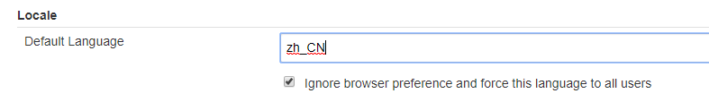
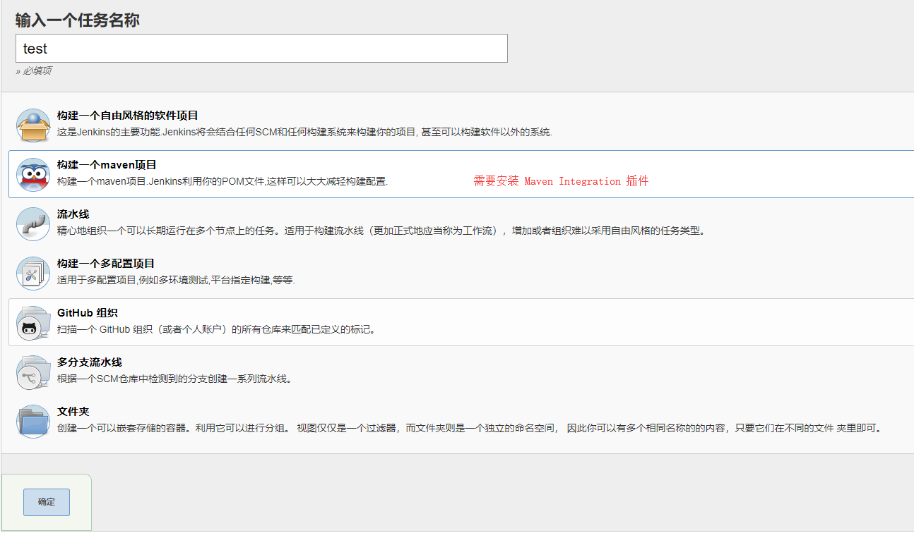
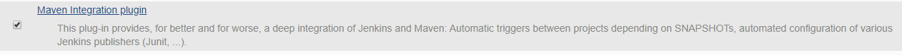

# jekins
## CI&CD

> `jenkins`是一款开源 CI&CD 软件，用于自动化各种任务，包括构建、测试和部署软件。

+ CI

  `CI`得概念就是`持续集成`

  指的是，实时对开发人员新提交得代码，进行构建和单元测试，根据单元测试得结果，决定是否将代码与原有代码进行集成

+ CD

  `CD`有2个概念

  + `持续交付`

    在持续集成的基础上，将集成后的代码部署到更贴近真实运行环境(类生产环境)中。

     
  
  + `持续部署`
  
    再持续交付的基础上，自动部署到生产环境
  
     

## 下载安装

### 下载

+ 在[jenkins官网](https://jenkins.io/zh/download/)查看最新LTS版本，但是不要直接进行下载，这里链接下载速度特别慢
+ 在[jenkins的war包镜像下载地址](http://updates.jenkins-ci.org/download/war/)中找到对应的版本进行下载

### 运行

+ 命令

  ```sh
  $ java -jar jenkins.war --httpPort=8080
  ```

+ 打开`localhost:8080`访问`jenkins`，进行安装

+ 运行war包时，控制台会打印一串密码，等待`jenkins`准备就绪后，输入该密码

+ 安装建议的那些插件


### 汉化

+ Manage Jenkins  -->  Manage Plugins  -->  Available 中搜索`Local`，安装该插件，等待安装结束

   

+ Manage Jenkins  -->  Configure System -->  找到`Local`配置项，填写`zh_CN`，并勾选`ignore...`

   


### 相关文件位置

+ 工作目录

  `~/.jenkins`

+ 

## 新建任务

+ 点击`新建任务`

   

  常用顺序为：maven项目、自用风格、流水线；其他的暂时可以不看

  maven项目需要安装`Maven Integration`插件

   

### 自由风格

+ General

  + 描述

    描述信息

  + Github项目

    如果是github项目时，可以勾选这项，直接指定github上项目的地址

+ 源码管理

  + 无

    一般应该用不到

  + git

    + Repository URL

      指定为克隆时，http方式的地址

    + Credentials

      指定用户名密码

    + Branches

      一般都是指定1个分支

+ 构建触发器

+ 构建环境

+ 构建

  > 构建的目的就是将代码进行打包

  + 调用顶层maven目标

    + 增加构建步骤  -->  调用顶层maven目标，选择配置好的maven环境

    + 目标

      ```
      clean install
      ```

    + 高级

      可以指定很多东西，如：maven配置文件

      注意：如果全局配置中配置发生了变更，这里不会一起改变，需要单独修改

+ 构建后操作

## 插件

### Locale plugin

汉化插件，参见[汉化](#汉化) 

### Maven Integration

用于新建任务时增加`构建1个maven项目`选项，参见[新建任务](#新建任务) 

### Publish Over SSH

用于将构建结果文件通过ssh发布到远程服务器

 

